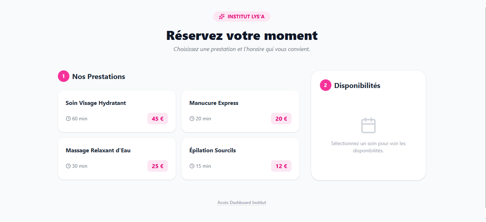
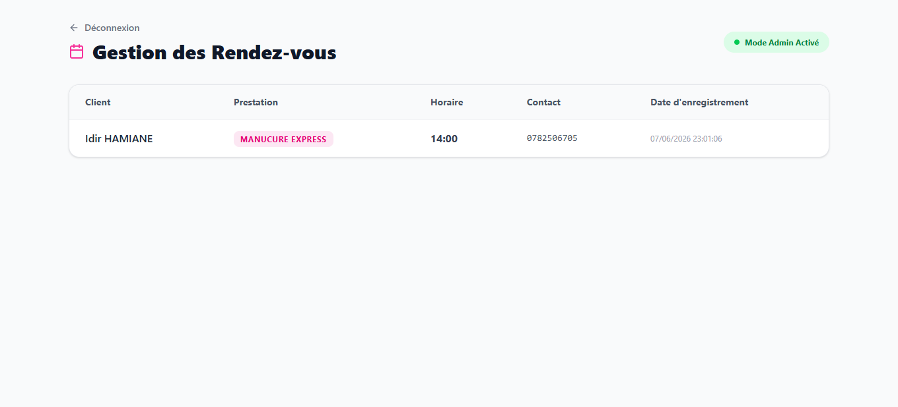
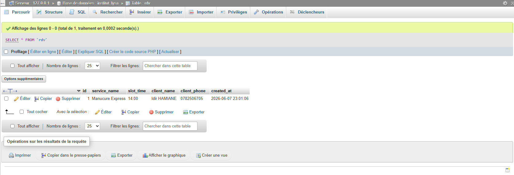

## 📸 Aperçu de l'application

### Interface Client


### Interface Admin


### Interface Base De Données


# 🌸 Institut Lys'A - Système de Réservation Full-Stack

Ce projet est une application web complète permettant aux clients d'un institut de beauté de prendre rendez-vous en ligne. Elle inclut une interface client dynamique et un tableau de bord administrateur sécurisé.

## 🚀 Fonctionnalités

### Côté Client
- **Sélection de prestations** : Choix dynamique parmi une liste de soins (Massages, Soins visage, etc.).
- **Calcul automatique** : Mise à jour en temps réel de la durée totale et du prix.
- **Formulaire de réservation** : Validation des coordonnées clients et envoi sécurisé vers la base de données.

### Côté Administrateur
- **Accès protégé** : Authentification par mot de passe pour accéder aux données sensibles.
- **Gestion des RDV** : Visualisation de l'ensemble des réservations enregistrées dans la base MySQL.
- **Interface Responsive** : Dashboard optimisé pour PC et Mobile avec Tailwind CSS.

## 🛠️ Stack Technique

- **Frontend** : React.js (Vite), Tailwind CSS v4, Lucide React (icônes).
- **Backend** : PHP (API REST), PDO pour la sécurité SQL.
- **Base de données** : MySQL (gérée via phpMyAdmin/XAMPP).
- **Versionnage** : Git & GitHub.

## 📦 Installation & Configuration

1. **Cloner le projet** :
   ```bash
   git clone [https://github.com/Idirh77/institut-lysa-booking.git](https://github.com/Idirh77/institut-lysa-booking.git)
   cd institut-lysa-booking
